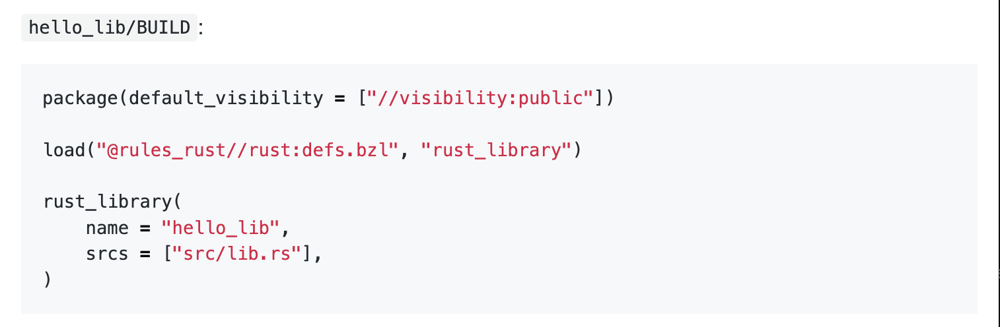
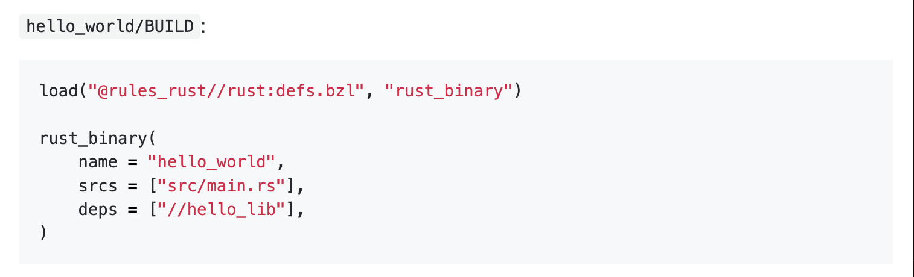

## Stage 3: Wrapping up

Wow, we've done it! We've built our project with bazel,
we are getting bazel to use our vendored dependencies,
things are looking up for us!

There's actually one part that I forgot,
something that is pretty important in a realistic Rust project.
And that's local dependencies.

> :eyes: There's also some small things that we can do,
> like using a more recent version of `rules_rust`.

## How did we get here?

Let's go through the upgrade first,
since it's pretty quick!
`rules_rust` has its releases available on
https://github.com/bazelbuild/rules_rust/releases.
Let's update it:

```python
{{ #include ./WORKSPACE.bazel:5:12 }}
```

> :eyes: Boom, done, next!

### Local Dependency

This requires a little project restructuring.
Let's move what we currently have in `backend` to a subdirectory
so we can add a sibling project to contain the dependency.
Let's call the new directory for the server, well, `server`.
For simplicity's sake, let's call the new library `math`
to contain the classic `double` function!

Let's work on making this project build on the cargo side,
then make the necessary changes on the bazel side.

First, let's update our workspace `Cargo.toml` file:

```toml
{{ #include ./.Cargo1.toml }}
```

And let's include a dependency on `math` and use the `double` function in `server`.

```toml
{{ #include ./backend/.Cargo1.toml:7:8}}
```

Running

```
cargo run
```

is available at `localhost:3000`!

> :facepalm: Sweet, seems good to me!

### Using a local dependency from `bazel`'s side

We will follow
https://bazelbuild.github.io/rules_rust/defs.html#rust_binary
for this.

Specifically,



and



Similar to how we exported our `backend`'s `Cargo.toml`,
we specify that `math` is a package.
If we wanted to restrict access to this library,
in case we wanted to reinforce architectural directory structure
(like in https://youtu.be/5OjqD-ow8GE?t=2089),
we could specify visibility other than `public`,
but let's do that now for the sake of getting up and running quickly.

```python
{{ #include ./backend/math/BUILD.bazel }}
```

Before we update our `backend/server/BUILD.bazel`
to list this library as a dependency,
let's see if `deps = all_crate_deps(),` does this for us automatically.
Let's run

```
bazel build //backend/server:hello_world
```

> :facepalm: Hmm, I'm running into a bunch of errors like
>
> ```
> error[E0405]: cannot find trait `IntoResponse` in this scope
>   --> backend/server/src/main.rs:41:11
>    |
> 41 | ) -> impl IntoResponse {
>    |           ^^^^^^^^^^^^ not found in this scope
> ```
>
> I'll try running our vendoring command again and see if that works:
>
> ```
> bazel run //3rd-party:crates_vendor
> ```
>
> ```
> /Users/preston/git/bazel-rust-guided-experiment/src/stage-3-upgrade-version/3rd-party/BUILD.bazel:6:14: no such package 'backend': BUILD file not found in any of the following directories. Add a BUILD file to a directory to mark it as a package.
>
> - /Users/preston/git/bazel-rust-guided-experiment/src/stage-3-upgrade-version/backend and referenced by '//3rd-party:crates_vendor'
> ```
>
> Ahh, yep, let's update our paths for our vendoring `BUILD.bazel`.

> :eyes: If `math` needed dependencies to function,
> we would probably add it's `Cargo.toml` at this point
> in the same location.

Trying to re-vendor, I get

```
INFO: Build completed successfully, 539 total actions
thread 'main' panicked at 'called `Option::unwrap()` on a `None` value', external/rules_rust/crate_universe/src/splicing/splicer.rs:78:86
note: run with `RUST_BACKTRACE=1` environment variable to display a backtrace
```

> :facepalm: Let's try adding `math`'s `Cargo.toml` to this list.

> :eyes: Should this work? If we just add the `Cargo.toml` here,
> do we expect an error or a successful result?
> If it's an error, what error do we expect?

Before bazel will let us do this, we need to export `math`'s `Cargo.toml`.
But, I'm still running into the same error.
This might be evidence that we need to add our
dependency on `math` to our `server/BUILD.bazel`,
or it could be that we are off the beaten path.

> :facepalm: I actually took a beat here to take a break.
> I checked to see if there were any examples that were doing what we are trying to do.
> I couldn't find any.
> After some more flailing, running lots of `bazel clean`'s,
> trying to revendor and running into errors,
> I decided to try another approach.
>
> I started from `stage-2`, but instead of going straight to adding a local dependency,
> I moved the folders to a structure that would support this.
> I noticed two things:
>
> 1. I was running into the same error, and
> 1. The directory structure didn't make much sense.
>
> Why is there this random nested folder?
> This pointed me to think that I was too quick
> to copy the server functionality into a sub-folder.
> Let's try again, but with `server`'s files inside of `backend`.

That gives us

```toml
{{ #include ./Cargo.toml }}
```

and

```toml
{{ #include ./backend/Cargo.toml::8 }}
```

for our root-level and "`server`" `Cargo.toml`'s.
Let's try from this point and see if we run into the same errors.

> :eyes: Let's check after all of this flailing that we are actually using
> `math` and that everything is setup correctly, including `Cargo.toml`'s
> as well as `BUILD.bazel`'s.
> This includes incorporating our dependency on `math` in our `BUILD.bazel`:
>
> ```
> {{ #include ./backend/BUILD.bazel:9}}
> ```

> :eyes: _Most_ of the pain points we've run into
> seem to be assumptions around directory structure that aren't immediately clear.
> We faced this for dependencies, original repo layout,
> and now for integrating local dependencies.
> Part of this might be natural ("Oh yeah, why didn't you add a subdirectory for the local dependency?"),
> but all of those project structures worked fine just with Cargo.
> Bazel is more opinionated in its folder structure.

## What did we do?

We made our project a little more realistic!
We used a more up to date version of `rules_rust` and added a local dependency to our project!

## What's next?

It's up to you!

> :tada: Doo-do-de-do do-do-do-doo!

```

```
